# RLHF

## 1.强化学习和语言模型的联系
**agent**: 语言模型本身

**state**: prompt(input tokens)

**action**: 选择哪个token作为下一个token（贪婪，top k,top p）

**reward model**：当生成‘好的回复’语言模型应当被奖励，当生成‘差的回复’语言模型不会受到任何奖励

**policy**：语言模型本身，因为它对动作空间给出当前状态的概率进行建模：\(a_t \sim \pi(\cdot | S_t)\)

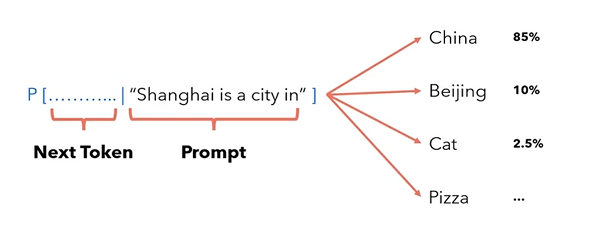


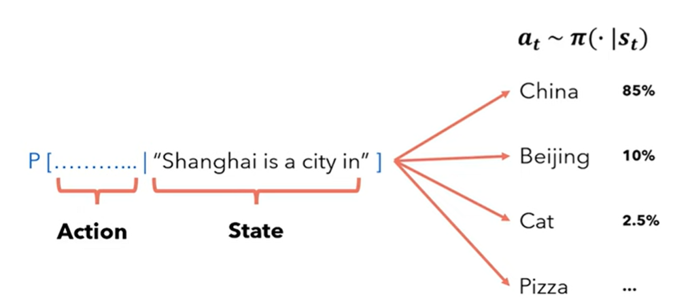

## 2. 语言模型的奖励模型

人类不擅长达成一致，但是我们很擅长比较

### 2.1 数据集

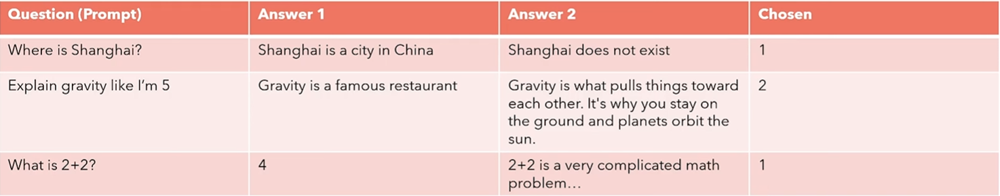

### 2.2 奖励模型架构

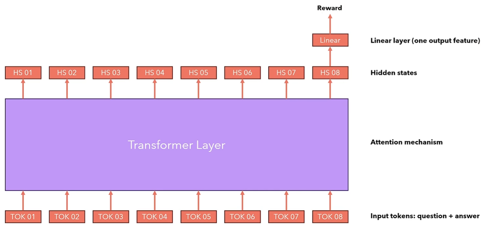

### 2.3 奖励模型损失
为了借助强化学习优化我们的语言模型表现，我们需要一个打分模型，对语言模型生成的每个回复给予一个数值。
现在我们有一个定义了基于一个query(prompt)下更喜欢的answer的数据集，我们可以搭建一个神经网络，使之可以对每一个response生成一个数字分数。

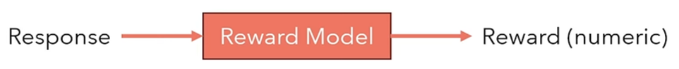

\[
\mathrm{Loss} = -\log \sigma \left(r(x, y_w) - r(x, y_l)\right)
\]

**good answer**：\(r(x, y_w)\)

**bad answer**：\(r(x, y_l)\)

如果 \(r(x, y_w) > r(x, y_l)\)，sigmoid 会返回一个 value > 0.5，loss 会很小。
	·如果顺序正确，loss会很小

如果 \(r(x, y_w) < r(x, y_l)\)，sigmoid 会返回一个 value < 0.5，loss 会很大。
	·如果顺序错误，loss会很大
	
Note:
sigmoid函数：

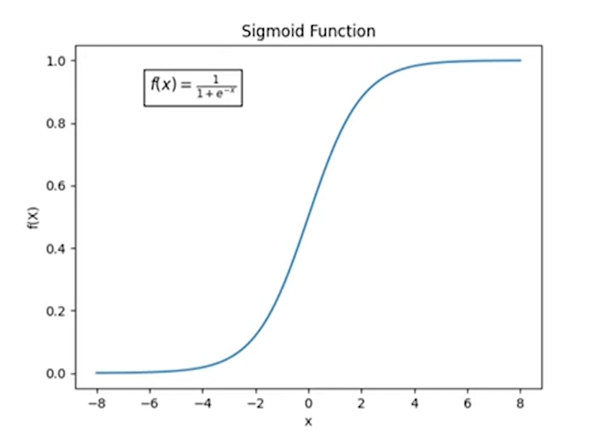

### 2.4 具体实现
在HuggingFace, 我们可以通过使用**RewardTrainer**和**AutoModelForSequenceClassification**训练一个custom reward模型，即拥有一个特殊先行层在顶部的语言模型。

我们只需要要求语言模型输出最后一个token的隐藏层，然后输入进线性层计算奖励，然后根据之前所说的Loss训练模型。

```python
   def compute_loss(
        self,
        model: Union[PreTrainedModel, nn.Module],
        inputs: dict[str, Union[torch.Tensor, Any]],
        return_outputs=False,
        num_items_in_batch=None,
    ) -> Union[torch.Tensor, tuple[torch.Tensor, dict[str, torch.Tensor]]]:
        rewards_chosen = model(
            input_ids=inputs["input_ids_chosen"],
            attention_mask=inputs["attention_mask_chosen"],
            return_dict=True,
        )["logits"]
        rewards_rejected = model(
            input_ids=inputs["input_ids_rejected"],
            attention_mask=inputs["attention_mask_rejected"],
            return_dict=True,
        )["logits"]
        # calculate loss, optionally modulate with margin
        if "margin" in inputs:
            loss = -nn.functional.logsigmoid(rewards_chosen - rewards_rejected - inputs["margin"]).mean()
        else:
            loss = -nn.functional.logsigmoid(rewards_chosen - rewards_rejected).mean()

        if self.args.center_rewards_coefficient is not None:
            loss += self.args.center_rewards_coefficient * torch.mean((rewards_chosen + rewards_rejected) ** 2)

        if return_outputs:
            return loss, {
                "rewards_chosen": rewards_chosen,
                "rewards_rejected": rewards_rejected,
            }
        return loss
```

## 3. 策略 Policy

### 3.1 强化学习中的轨迹

我们之前说过，强化学习的目标是选择一个policy,当agent根据这个策略行动可以最大化返回的期望值。
\[
\pi^* = \arg\max_\pi J(\pi)
\]

策略的期望值，就是所有可能轨迹(trajectories)期望值之和：

\[
J(\pi) = \int_\tau P(\tau | \pi) R(\tau) = \mathbb{E}_{\tau \sim \pi} [R(\tau)]
\]

轨迹是从初始state开始的一系列（action, state)：

\[
\tau = (s_0,a_0,s_1,a_1, ···)
\]

我们把下一个状态视作随机的并进行建模：

\[
s_{t+1} \sim P(\cdot | s_t, a_t)
\]

因此我们可以用下面的公式定义轨迹·：

\[
P(\tau | \pi) = \rho_0(s_0) \prod_{t = 0}^{T - 1} P(s_{t+1} | s_t, a_t)\pi(a_t | s_t)
\]

我们通常倾向于使用折扣奖励（因为我们喜欢及时奖励而不是长远奖励）：

\[
R(\tau) = \sum_{t = 0}^{\infty}\gamma^t r_t
\]

Note: \(0 < \gamma < 1\)

如下如所示，计算的时候应该是：

\[
R(\tau) = \gamma^1 \cdot (-1) + 0 + \cdots + \gamma^8 \cdot 100
\]

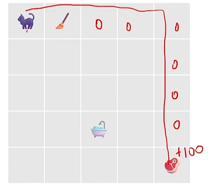

### 3.2 语言模型下的轨迹
当我们处理的是一个语言模型时，我们希望能微调语言模型使之以获取最大reward的路径选择下一个token：

\[
\pi^* = \arg\max_\pi J(\pi)
\]

轨迹是从一系列prompts(state) 和他们下一个token(action)

\[
\tau = (s_0,a_0,s_1,a_1, ···)
\]

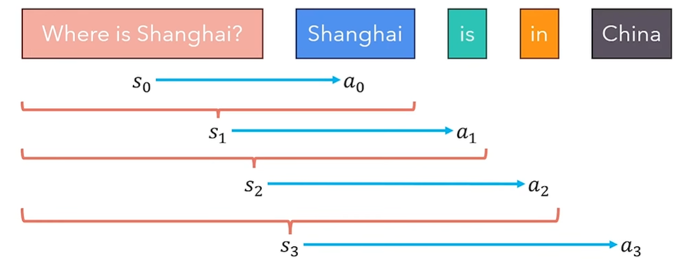

目标：策略的期望最大

也就是：训练一个 policy 神经网络 \(\pi\)，在所有状态 \(S\) 下，给出相应的 Action，得到的 Return 期望最大。

也就是：训练一个 policy 神经网络 \(\pi\)，在所有的 Trajectory 中，得到的 Return 期望最大。

### 3.3 使用策略梯度优化训练一个policy网络
\[
J(\pi_\theta) = E_{\tau \sim \pi_\theta} [R(\tau)]
\]

当我们提到深度神经网络，我们的目标是迭代地改变神经网络的参数来最小化损失函数的值，这是典型随机梯度下降的用法，但是在我们的案例中，我们希望最大化这函数，因此我们使用随机梯度上升：

\[
\theta_{k+1} = \theta_k + \alpha \nabla_\theta {J(\pi_\theta)|}_{\theta_k}
\]

策略的梯度叫做 policy gradient, 优化这种策略的算法叫做policy gradient algorithms.

现在的问题就是，如何计算梯度，我们需要考虑所有可能的轨迹，这在计算上是不可行的，因为这是一种computationally intractable问题，除非我们有一个很小的state space。

#### a. 梯度表达式：
\[
\nabla_\theta J(\pi_\theta) = \nabla_\theta \mathbb{E}_{\tau \sim \pi_\theta}[R(\tau)]
\]

\(R(\tau)\)：一条轨迹的总回报。

\(\tau \sim \pi_\theta\)：轨迹是从策略 \(\pi_\theta\) 中采样得到的。

#### b. 期望扩展为积分（连续就是积分，离散就是求和）：
\[
\nabla_\theta \mathbb{E}_{\tau \sim \pi_\theta} [R(\tau)] 
= \nabla_\theta \int_\tau P(\tau|\theta) R(\tau) d \tau
\]

#### c. 将梯度移到积分内部（换序积分定理（也称为微分与积分的交换定理））：
\[
\int_\tau \nabla_\theta P(\tau|\theta) R(\tau) d \tau
\]

#### d. 引入对数导数技巧（log-derivative trick）：

\[
\nabla_\theta P(\tau|\theta) = P(\tau|\theta) \nabla_\theta \log P(\tau|\theta)
\]
代入后，得到：

\[
\int_\tau P(\tau|\theta) \nabla_\theta \log P(\tau|\theta) R(\tau) d\tau
\]
#### e. 返回期望形式：

\[
\mathbb{E}_{\tau \sim \pi_\theta} [ \nabla_\theta \log P(\tau|\theta) R(\tau)]
\]


#### f. 分解轨迹的概率：
\[
P(\tau|\theta) = \rho_0(s_0) \prod_{t=0}^T \pi_\theta(a_t|s_t) P(s_{t+1}|s_t, a_t)
\]

Note：环境的动态模型（状态转移概率）与策略参数无关，所以对 \(\theta\) 求导只作用在策略上。

如下所示，等式两边同时加上log:

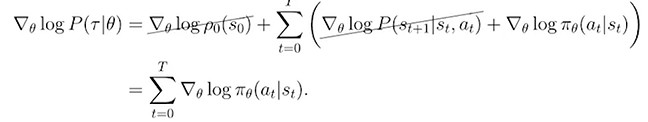

#### g. 最终公式（策略梯度）：
\[
\nabla_\theta J(\pi_\theta) =
\mathbb{E}_{\tau \sim \pi_\theta}
\left[
\sum_{t=0}^T \nabla_\theta \log \pi_\theta(a_t | s_t) R(\tau)
\right]
\]

\(R(\tau)\)：轨迹的总回报。

\(\log \pi_\theta(a_t | s_t)\)：每个时间步策略的对数概率。

对于这个期望值，我们可以通过对收集到的一组轨迹（也就是一系列行动的记录）进行采样平均来近似这个期望值。

换句话说，我们通过观察和记录多个回合的行动，然后计算这些记录的平均值，来估计这个期望值。

\[
\hat{g} = \frac{1}{|D|} \sum_{\tau \in D} \sum_{t=0}^T \nabla_\theta \log \pi_\theta(a_t|s_t) R(\tau)
\]

### **RECAP:截至目前，我们学会了什么？**

目标：通过梯度方法优化策略的参数 ，以最大化预期奖励。

算法步骤：
#### a. 创建策略网络：

使用一个神经网络定义策略 \(\pi_\theta\)，输入为当前状态 \(s_t\)，输出为在动作空间上的概率分布 \(\pi_\theta(a_t | s_t)\)。

#### b. 采样轨迹：

使用策略 \(\pi_\theta\) 来与环境交互，生成轨迹（包括状态 \(s_t\)、动作 \(a_t\)、奖励 \(R(\tau)\)）。通常每条轨迹可以运行固定步数（如 100 步）或直到达到终止条件。

#### c. 计算梯度：

根据公式：

\[
\hat{g} = \frac{1}{|D|} \sum_{\tau \in D} \sum_{t=0}^T \nabla_\theta \log \pi_\theta(a_t|s_t) R(\tau)
\]

#### d. 更新策略参数：

使用随机梯度上升更新参数：

\[
\theta_{k+1} =\theta_k + \alpha \nabla_\theta J(\pi_\theta)|_{\theta_k}
\]

#### e. 循环迭代：

返回第 b 步，继续采样新的轨迹并重复以上步骤，直到收敛。

### 4. 为语言模型生成轨迹
还记得我们为reward model建立的偏好数据集吗？我们使用这些问题询问模型以生成回答。然后我们计算生成回答的reward，并根据估计的策略梯度训练模型。

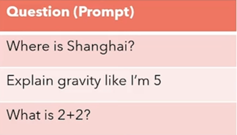

如何计算语言模型的策略log probabilities

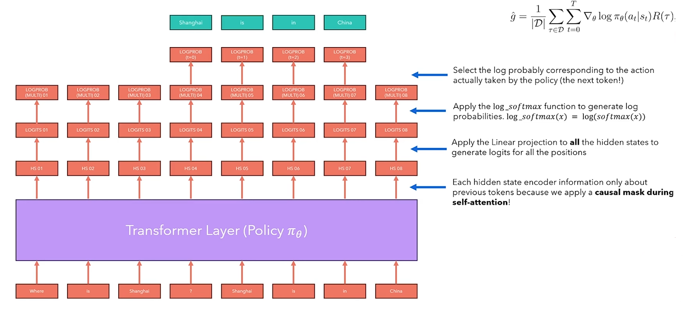

计算每个轨迹的reward

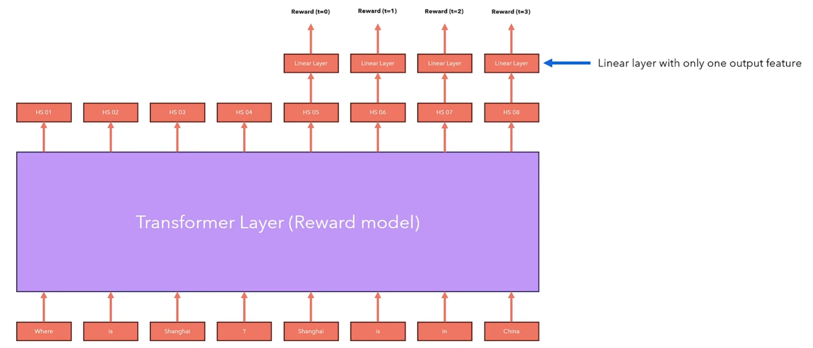

### 4.1 策略梯度优化GPO存在的问题

### **问题：**
梯度估计是无偏的(unbiased)（意思是他可以收敛到真实的梯度），但是它具有很高的方差（varience)

**解决：**
### **方法一** : 采用 "rewards to go"（剩余奖励）来替代整条轨迹上的累积奖励
\(R(\tau)\)

核心思想：you can't alter the past

#### a. **原始梯度公式**
最初的梯度公式：

\[
\nabla_{\theta} J(\pi_\theta) =
\mathbb{E}_{\tau \sim \pi_\theta}
\left[
\sum_{t=0}^{T} \nabla_\theta \log \pi_\theta(a_t | s_t) R(\tau)
\right]
\]

- **问题**：公式将整个轨迹的累积奖励 \(R(\tau)\) 与所有时间步的梯度相乘。
- **结果**：由于 \(R(\tau)\) 包含了从 \(t=0\) 到 \(T\) 的所有奖励，梯度的方差非常高，尤其是在奖励稀疏或延迟时。

---

#### b. **改进：按时间步分解奖励**
将公式重写为：

\[
\nabla_{\theta} J(\pi_\theta) \approx \frac{1}{N} \sum_{i=1}^{N} \sum_{t=0}^{T} \nabla_{\theta} \log \pi_\theta(a_{i,t} | s_{i,t}) \left( \sum_{t=0}^{T} r(s_{i,t}, a_{i,t}) \right)
\]

- 每个动作梯度乘以整条轨迹的奖励总和。
- **发现的问题**：对于一个具体时间步 \( t \)，轨迹中之前的奖励（即 \( t'<t \) 的奖励）对当前动作无关紧要，却仍然被考虑进了公式（因为过去已经无法改变）。

---

##### c. **引入 “rewards to go”**
为了减少方差，使用 "rewards to go" \(\sum_{t'=t}^{T} r(s_{i,t'}, a_{i,t'})\) 来替换原始的轨迹总奖励 \(R(\tau)\)。改写后的公式为：

\[
\nabla_{\theta} J(\pi_\theta) \approx \frac{1}{N} \sum_{i=1}^{N} \sum_{t=0}^{T} \nabla_{\theta} \log \pi_\theta(a_{i,t} | s_{i,t}) \left( \sum_{t'=t}^{T} r(s_{i,t'}, a_{i,t'}) \right)
\]

- **解释**：
  - 对于每个时间步 \(t\)，只计算从当前时间步到轨迹结束的累积奖励。
  - 忽略过去的奖励，因为它们在期望中会相互抵消，不影响最终梯度的无偏性。

---

#### d. **减少方差的原因**
- 原始公式中，过去的奖励 \(t' < t\) 对当前动作梯度没有直接影响，但由于被包含进公式中，会引入额外的噪声（方差）。
- 改用 "rewards to go" 后，公式更准确地反映了当前动作对未来奖励的直接影响，从而降低了梯度估计的方差。

### **方法二**：引入基准函数（Baseline）来进一步减少梯度估计方差。

- **目标**：通过引入基准函数 \(b\)，减少梯度估计的方差，改善优化过程的稳定性。
- **常用基准**：状态价值函数 \(V^\pi(s)\)，也可以使用其他函数，具体取决于任务和模型的设计。
- **优势**：减小了无关噪声的影响，让策略更专注于改进未来表现。

#### a. **梯度公式中的基准函数**
基础的梯度公式为：

\[
\nabla_{\theta} J(\pi_\theta) \approx \frac{1}{N} \sum_{i=1}^{N} \sum_{t=0}^{T} \nabla_{\theta} \log \pi_\theta(a_{i,t} | s_{i,t}) \left( \sum_{t'=t}^{T} r(s_{i,t'}, a_{i,t'}) \right)
\]

通过引入一个**基准函数 \(b\)**（Baseline），公式变为：

\[
\nabla_{\theta} J(\pi_\theta) \approx \frac{1}{N} \sum_{i=1}^{N} \sum_{t=0}^{T} \nabla_{\theta} \log \pi_\theta(a_{i,t} | s_{i,t}) \left( \sum_{t'=t}^{T} r(s_{i,t'}, a_{i,t'}) - b \right)
\]

#### b. **为什么引入基准函数？**
1. **无偏性**：可以证明，减去一个基准函数 \(b\) 并不会改变梯度估计的**无偏性**。
   - 也就是说，基准函数的引入不会对梯度的方向或期望值产生影响。
2. **减少方差**：引入基准函数后，公式中引入了一种对奖励的“校正”，从而有效减少了梯度估计中的方差。

#### c. **选择基准函数的方式**
常用的基准函数是**状态价值函数 \(V^\pi(s)\)**：

\[
V^\pi(s) = \mathbb{E}_\pi \left[ \sum_{t'=t}^{T} r(s_{t'}, a_{t'}) \, | \, s_t = s \right]
\]

- **解释**：
  - \(V^\pi(s)\) 表示从当前状态 \(s_t\) 出发，按照策略 \(\pi\) 所能获得的期望未来奖励。
  - 使用 \(V^\pi(s)\) 作为基准，可以有效去掉与当前状态 \(s_t\) 无关的波动。

例子：高值状态与低值状态

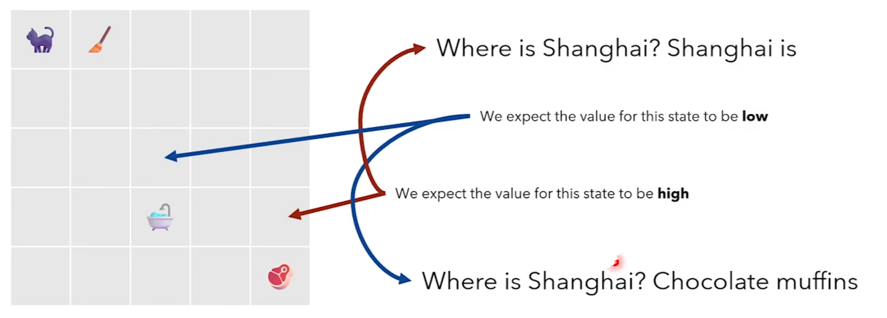

- 对于某个状态 \(s_t\)，如果期望的未来奖励（价值）较低，基准值会相应较低。
- 如果某个状态的未来奖励较高（即更接近目标或有利），基准值会较高。
- 减去基准值后，梯度更新会更聚焦于当前动作的实际贡献，而不是受环境噪声或总体奖励波动的影响。

估计 \(V^\pi(s)\)：

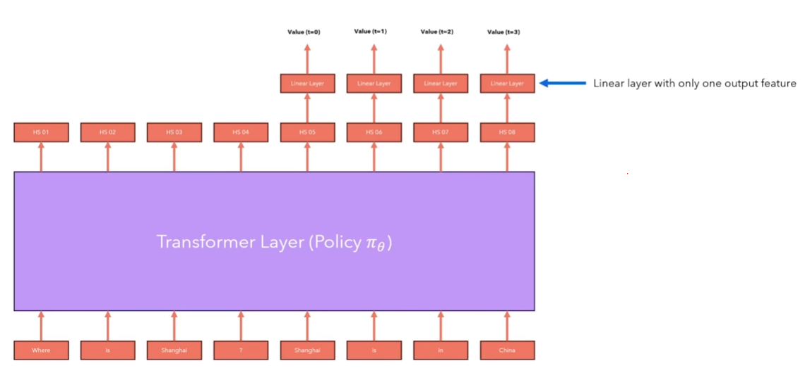

注意：语言模型已经有一个线性层（把隐藏层转化为logits值）这里添加的是另一个线性层。

#### d. **具体优化效果**
- 引入基准函数后：
  - 当 \(\sum_{t'=t}^{T} r(s_{i,t'}, a_{i,t'})\) 大于基准值 \(b\) 时，表示当前动作比预期更好，梯度更新会倾向于强化该动作。
  - 当 \(\sum_{t'=t}^{T} r(s_{i,t'}, a_{i,t'})\) 小于基准值 \(b\) 时，表示当前动作比预期更差，梯度更新会倾向于削弱该动作。

#### e. **引入 Q 和 V**：


(未完待续)
