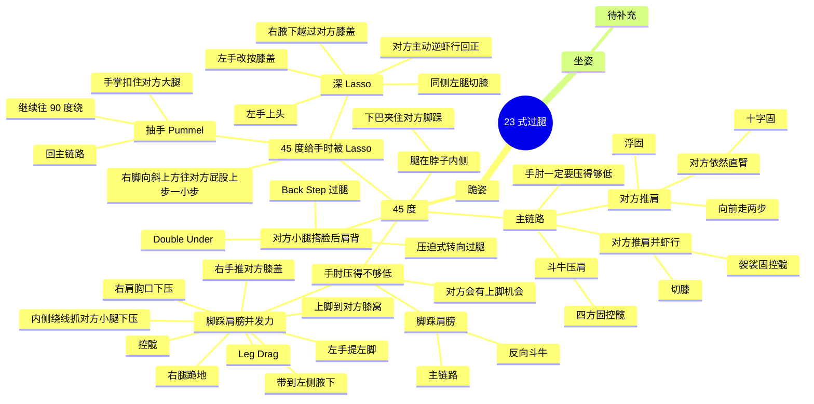

# 23 式过腿

对方躺姿的外侧过腿起手  1.斗牛： 同侧手控制对方同侧裤腿内侧，压在地面。 滑步走45度，另一只手曲肘控髋（直臂容易被踩）保持头低于对方膝盖的高度匍匐平板支撑，（camping）移动至90度。下左侧肩膀压住对方，再落腿跪下，到侧控。控腿的手控髋。  2 接浮固 在45度位置发现对方推我，且无力下压对方腿。将下压腿改为提拎，将对方侧躺的身躯带正。上步上浮固。如果对方在被浮固位置继续推可以找手臂十字固。  3根据对方反应接切膝 在方上步想浮固时对方没被控制的腿踩地做虾行的瞬间，继续施压控制对方的一侧腿在地上。对方髋此时是打开的。转髋切膝，保证对方没有膝盾。直接找对方同侧大臂滑膝位置，用屁股展开对方身体。保持这个姿态，不到侧控。  4.对方另一侧脚踩肩或者类似于膝盾浮在空中时转leg drag. 45度时发现没法拿到对方的内侧髋。另一只手找对方踩肩腿胫骨压住（收住）。️细节：手从内向外pamo压住腿。左手死死的将同侧腿重心钉在地上。重心在两侧手上，像圆规一样往反方向滑步。钉地手不动，右手将对方脚带到左侧腋下。左脚上步到对方被钉地面脚的膝窝内侧。右腿可以往后调整一点（整个人有点类似于三角形结构，注意腿的力线）,以便接下来保持重心。右手用力将对方膝盖推向左侧腋后。上半身向前用胸盖住leg drag腿膝盖。再下压。右腿跪地同时右肩找对方胸口下压。左手从钉腿转到近侧髋控制，右手控制远髋。双手换到对方髋两侧。双膝打开。到控髋的侧控位置。（注意️此时距离cross face侧控还有距离）  5 对方另一侧脚踩肩或者类似于膝盾浮在空中时接斗牛或者换边pass 初步部署同上。按住对方踩肩脚后从内侧绕手压对方髌骨（若绕不过来则考虑身子后倾让出空间），继续往90度方向走，如果对方推则拉起进浮固。如果对方手没有推就直接下肩膀斗牛侧控。也可以压着对方髌骨后往反侧走，同时另一只手去找髋，反向斗牛过腿。  6对方回防腿架在同一侧肩膀上，进入压迫式转向过腿 ️45度，一手腿一手髋打入。对方回防失误（？）大腿膝窝架在我的肩膀上。同侧手under hook架着的腿，并且抄到腰带。注意️抓腰带用反手，手心朝上。用架着腿侧肩膀向前施压，脚步也上前，到一个三角稳定蹲姿（左脚类似于leg drag卡住对方地面腿）将重心转移到身体右侧，先下右膝跪，再将控腰带手小臂压紧对方髋部。重心放在这只小臂上。左脚从向后滑步，做一个类似于原地长步动作，同时左手拉住同侧腿，迫使对方腿被拉长。滑步back step后让自己右肩压住对方胸口，可以的话不要让自己髋落地（重心压力更多）。到侧面控住双髋（道带手控近侧髋，另一只手盖到对侧），转为控髋侧控。  7 对方回防腿架在对侧肩膀上，换手backstep过腿 发起同上。 在45度往前压迫，跪左侧膝盖。右手换左手在库把。左手环抱对方上肩膀腿。右手提拉对方腿，记得手肘要收紧。左肩重心压到对方身体外侧，做back step.屁股清掉髋。到南北胸贴胸。  8 对方回防腿架在对侧肩膀上，然后伸展身躯防守。转duck under 同上发起换手。 做雨刷转到另一侧。  9.对方回防脚心踩住我对侧肩膀。我用下巴卡住其髌骨，右手抱住对方髋。左脚上步到leg drag发起位置。左手配合右手收到leg drag.右肩下压过腿。  10 . 45度给手时被拿lasso，对方力量适中。一定要在对方斜45度发起：左手压紧同侧腿，右脚斜上方往对方屁股上步一小步。做直臂抽手再pamo到手掌扣住大腿。继续往同侧90度绕。对方不支撑就下肩斗牛。对方手撑就浮固。  11.45度给手时被拿lasso，对方lasso把力无穷。一般此时对方还会主动逆虾行把laso回正。回正自己就不用回正了。没回正注意这个技术的前提是回正（正面对对方）： 左手控制压地面的腿膝盖，将膝盖紧按地面。在同侧腿左腿切过去后将左手转对方头顶正上方（整个人正正的处于对方身体上方），被控制laso的右手此时应该可以用腋下越过对方的膝盖盖住使laso无效。左手找cross face、back step，右手抽回来藏住，控同侧髋到侧控。  12对方lasso搭上后另一侧没有控制，直接往lasso的对侧角度走，调整步伐做拉弓状态切掉laso手。
