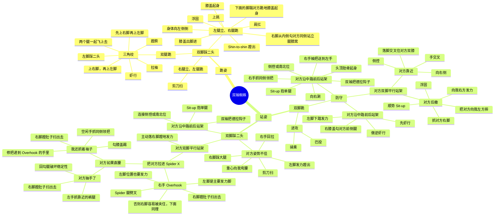

# 双袖蜘蛛

双袖把蜘蛛控制 为什么双袖把？女生和大级别（力大者容易依赖上肢手臂力量）对抗最不吃亏的把位。所以可以纳入下位选择系统。  怎样才好拿到双袖把？ 1.进入close gurad. 领把+三头+踩髋= 直接pull close guard 捕捉对方双手。若对方逃避另一侧手，就那衣领绞骗出手。 蜘蛛把握法：翻开对方袖子口，然后大拇指盖住，切勿绕到内侧。 开guard脚，做虾行塞膝盖x2次，来到双脚踩髋双袖把控制的状态。   2.对方若将手握住我的道带或者髋。 做踩髋起桥+双膝盖往外开。破把  3.长短蜘蛛正确做法 同上，踩上双蜘蛛。用脚的外侧卡对方肘窝，脚的足弓垫靠下侧踩二头。形成一个立体脚踩位置（类似于卡在墙角）。 踢出一侧蜘蛛，另一侧拉紧袖把，整个人髋不要侧过去（骨盆朝上），让短蜘蛛的脚尽量往自己身体收，切记此时不要蹬对方二头只是搭着。 长短蜘蛛控制与对方距离的法则：拉的力量大于踩的力量我的髋离对方越近？反之亦然。  3.从双髋双袖位置转三角。 一侧脚搭上蜘蛛，另一侧踩髋，踩髋侧拉住袖把将对方手臂带到身上（注意要手臂而不是手，若拉不住则需要自己向后搓一下），再将其手臂带到身体对侧。踩髋起桥，蜘蛛侧脚上对方脖子，膝盖窝紧扣脖子，搭扣。双脚回勾脚趾。双手扶头，发力。  4.猎枪十字固。 对方跪姿，单侧手拉蜘蛛，单侧脚踩髋准备进攻时，对方控制踩髋腿，并用手牢牢压在地面，且还没来得及同侧切膝时准备发起：被压地面脚向外开，踩地做个夸张的逆虾行。让我的头转到对方肩膀下面（横过来90度），用c字把将对方压腿手肘抓到胸口固定，再悠腿摆到对方对侧脖子上，卡猎枪十字固。  5.从双髋双袖位置转剪刀扫 一侧脚搭上蜘蛛，另一侧踩髋。对方若在脚并拢，则髋处脚落在对方同侧脚外侧，同时蹬蜘蛛+砍腿+肘撑地转向。扫倒接骑乘。 若对方底盘稳，双脚分开比较大。则将砍腿换成踢对方膝盖内侧。再做剪刀扫。  6.剪刀扫转三角 对方挺直上半身防剪刀扫时可以让脚踩地逆虾行直接起髋蜘蛛腿去拿到一个卡脖子的位置，搭扣。完成三角。
