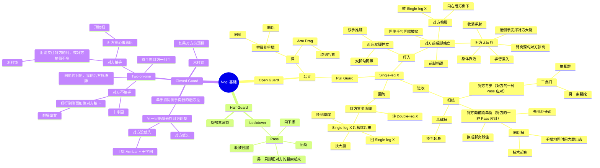

# Nogi 基础

```mermaid
mindmap
  root((Nogi 基础))
    Open Guard
        站立
            Pull Guard
                Single-leg X
                    打入
                        对方双脚并立
                            双脚勾脚踝
                            双手推膝
                        对方前后脚站立
                            前脚挡踝
                            同侧手勾同腿膝窝
                            对方抬脚
                                向右后方倒下
                                转 Single-leg X
                            对方无反应
                                手臂深入
                                身体靠近
                                臂窝深勾对方膝窝
                                远侧手支撑对方大腿
                                收紧手肘
                    进攻
                        扫技
                            基础扫
                                换手起身
                            对方背步（对方的一种 Pass 应对）
                                三点扫
                                    换脚蹬
                                    另一条腿挖
                            对方向前跪单腿（对方的一种 Pass 应对）
                                先用胫骨踢
                                换成脚窝踩住
                                向后扫
                                    手撑地同时用力蹬出去
                                    技术起身
                    回防
                        对方背步清脚
                            Single-leg X 起桥挑起来
                                扶大腿
                                换到脚踝
                                回 Single-leg X
                            转 Double-leg X
            摔
                Arm Drag
                    绕到后背
                推肩抱单腿
                    向后
                    向前
    Half Guard
        Lockdown
            Pass
                向下挪
                抬腿
                另一只脚把对方的腿架起来
                收被控腿
        腿部三角锁
    Closed Guard
        单手抓同侧手向我的后方拉
            另一只胳膊去抄对方的腿
                对方没低头
                    上腿 Armbar + 十字固
                对方低头
        Two-on-one
            双手抓对方一只手
            向他的对侧、我的后方拉胳膊
            对方不抽手
                十字固
                虾行到侧面扣住对方腋下
                    翻腾拿背
            对方抽手
                肘能夹住对方的肘，或对方抽得不多
                    木村锁
                对方重心很靠后
                    顶髋扫
        木村锁
            如果对方前滚翻
```
